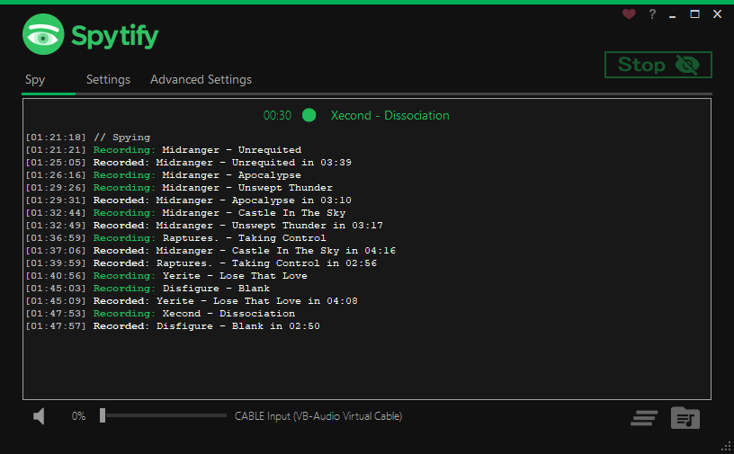

Spytify is a Spotify recorder for Windows which records Spotify audio without recording or playing ads, ensuring no loss in sound quality. It automatically splits songs into separate tracks and records to MP3 with media metadata, meaning you can start easily enjoying your music offline.

### [How it works?](#how-it-works)

Spytify records what Spotify outputs, which is a longer process than downloading a Spotify playlist with a tool.

However, Spytify ensures that all tracks will be the official released one, all sound volume normalized and with media tags and album cover. Playlist Downloaders get mostly all tracks from YouTube which means that they can't guarantee the choosen track will fit 100% the one in your playlist and they will all be the same quality.

Spytify records the same quality that Spotify outputs ([Spotify Free 160kbps, Spotify Premium 320kbps](https://support.spotify.com/us/article/high-quality-streaming/)), so the recorded copy will be indistinguishable from Spotify’s one.

<figure>
    <figcaption>Listen to an mp3 sample at 120kbps:</figcaption>
    <audio
        controls
        src="./assets/audio/sample.mp3">
            <code>Your browser does not support the <kbd>audio</kbd> element.</code>
    </audio>
</figure>

### [How to use it?](#how-to-use-it)

A standard use is to start a recording session using your favorite playlist and let it record overnight, so you avoid waiting for it to end, because Spytify does not download but records. You will then get all your songs automatically split into separate tracks without ads and with metadata.

A recorder requires a good sound card to be able to record good quality, that's why Spytify comes with a Virtual Audio Cable device, if you have issues with your sound card (volume slider and other apps sound affects the recordings, or overall recorded sound quality is worst than Spotify) you can install this virtual device using the **Speakers+** icon in Spytify settings.

Don't forget to hit the [F.A.Q.](./faq.html) for tips on:

- [_How to install Virtual Audio Cable device for better recording quality?_](./faq.html#install-better-audio-endpoint-device)
- [_How to isolate Spytify and Spotify on a virtual audio device to avoid background noices?_](./faq.html#isolate-spotify-audio-endpoint)
- [_How to reroute sound/output of a virtual audio device to my main audio device to listen to it?_](./faq.html#listen-to-virtual-device)
- [_How to connect to Spotify API for more accurate media tags?_](./faq.html#media-tags-not-found)

### [Requirements](#requirements)

Spytify runs on Windows only.

- Microsoft Framework ([.NET 4.6.1](https://www.microsoft.com/en-ca/download/details.aspx?id=49981) or higher).
- Spotify Desktop application.

A **free Spotify account** will work, but Spotify restricts audio quality to 160 kbps. Having a Premium Spotify subscription will enable recording of up to 320 kbps audio.
