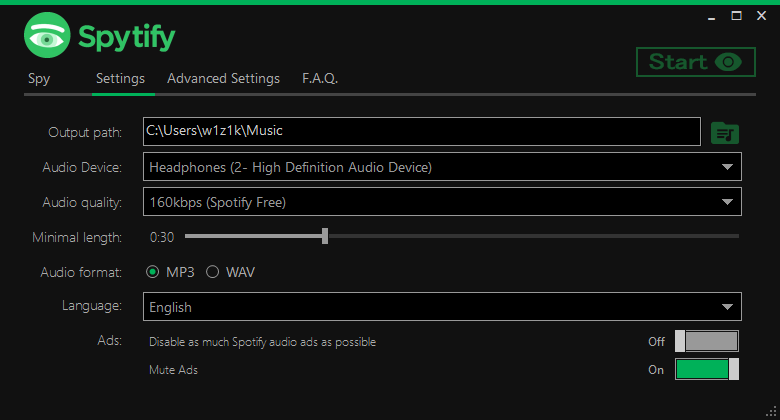
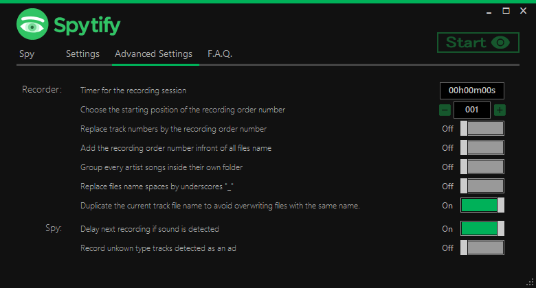

    
    

## [Parameters](#parameters)

| Parameter               | Description and values                 | Default value  |
|:------------------------|:---------------------------------------|:---------------|
| Output path             | Folder where recorded songs will be stored | `Music`     |
| Audio device            | Audio device that Spytify will listen on. Must be the same one than Spotify uses, for Spytify to be able to record. Spotify/Spytify default audio endpoint can be change in **Windows 🡂 Sound Settings 🡂 App volume and device preferences**. More details in [F.A.Q.](./faq.html#isolate-spotify-audio-endpoint) | `Default`   |
| Audio quality           | From Low to High `128kbps` `160kbps (Spotify Free)`¹ `256kbps` `320kbps (Spotify Premium)`² | `160kbps`¹ |
| Minimal length          | Remove songs shorter that the time set  | `30s`  |
| Audio format            | `WAV` and `MP3` (adds media info and album cover) | `MP3`    |
| Language               | Currently supporting `English` and `French` | `English` |
| Ads               | Mute audio ads when detected | `On` |

> ¹ Spotify Free account will stream at a max rate of 160kbps, so you shouldn't go above that quality.     
> ² Spotify Premium account will stream at a max rate of 320kpbs (if max quality is enabled in Spotify settings), so you shouldn't go above that quality.

## [Advanced Parameters](#advanced-parameters)

| Recorder Parameter                   | Description and values                 | Default value  |
|:-------------------------------------|:---------------------------------------|:---------------|
| Timer for the recording session      | It sets a timer that will stop the recording session after the giving time until the end of the playing track | `00h00m00s` |
| Recording order number starting position   | Changing the position will take effect if one of the recording number options below is enabled. Change this number when resuming an old recording session. More details in [F.A.Q.](./faq.html#recording-order-number) | `001` |
| Replace track numbers by number above      | Replace the album track number in the media info by the recording order number | `Off` |
| Add number above infront of filenames     | Add a recording order number infront of files name `001 Artist - Title.mp3` | `Off` |
| Group artists by folder              | Group songs by folder titled with the artist's name and remove the artist of the file name `../Artist/Title.mp3` | `Off` |
| Files names with underscores      | Remove from the file name any space and replace it by underscores `Artist_-_Title.mp3` | `Off` | 

| Spy Parameter                | Description and values                 | Default value  |
|:-----------------------------|:---------------------------------------|:---------------|
| Delay next recording         | Delay the recording of the next song if sound is detected or the 1 second timeout is reached | `On` |
| Record unkown type of tracks | Records anything that plays and unmute ads, because podcasts are detected as an ad  | `Off` |
